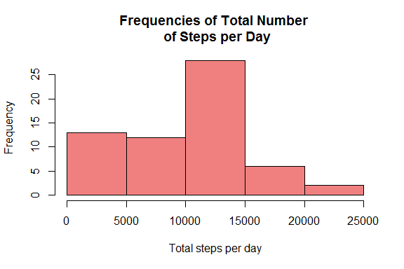
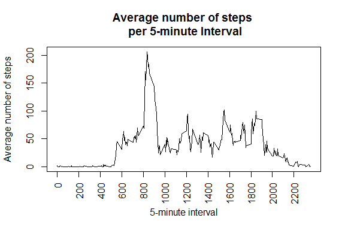
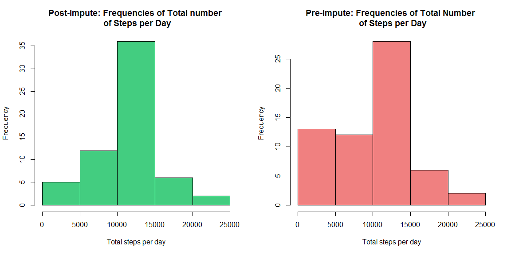
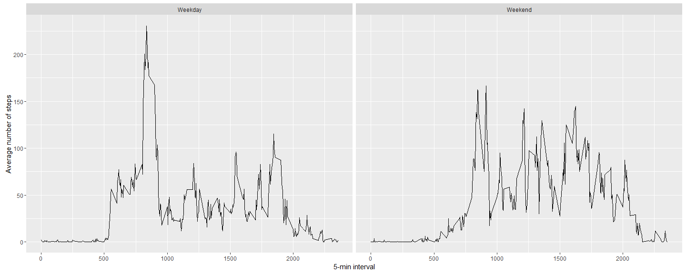

# Reproducible Research - Assignment 1
Amy Galvin  
24 April 2016  

========================================================= 

#Loading and Pre-processing the Data 

=========================================================
  
Before we begin exploring the data, we must set our working directory and read in the data. At this point, we can also load in some of the libraries we might want to use, such as dplyr, ggplot2, etc...


```r
setwd("C://Users/Amy/Desktop/RCoursera/4-ReprodRes/Proj1")
data<-read.csv("activity.csv")
library(knitr)
library(dplyr)
library(ggplot2)
```

Let's examine the data a little bit. We will look at the dimensions of the data frame and the first 20 rows:


```r
dim(data)
```

```
## [1] 17568     3
```

```r
head(data, 20)
```

```
##    steps       date interval
## 1     NA 2012-10-01        0
## 2     NA 2012-10-01        5
## 3     NA 2012-10-01       10
## 4     NA 2012-10-01       15
## 5     NA 2012-10-01       20
## 6     NA 2012-10-01       25
## 7     NA 2012-10-01       30
## 8     NA 2012-10-01       35
## 9     NA 2012-10-01       40
## 10    NA 2012-10-01       45
## 11    NA 2012-10-01       50
## 12    NA 2012-10-01       55
## 13    NA 2012-10-01      100
## 14    NA 2012-10-01      105
## 15    NA 2012-10-01      110
## 16    NA 2012-10-01      115
## 17    NA 2012-10-01      120
## 18    NA 2012-10-01      125
## 19    NA 2012-10-01      130
## 20    NA 2012-10-01      135
```

Wow! Look at all of those NA values! For right now, we will ignore them. We will deal with those guys later on...

We can see that the second column contains the date of the measurement. Let's see what class each column is:


```r
class(data$steps)
```

```
## [1] "integer"
```

```r
class(data$date)
```

```
## [1] "factor"
```

```r
class(data$interval)
```

```
## [1] "integer"
```

Right now, the date looks to be of the class "factor". Let's make that column of the date class instead.


```r
data$date<-as.Date(data$date)
class(data$date)
```

```
## [1] "Date"
```

```r
head(data)
```

```
##   steps       date interval
## 1    NA 2012-10-01        0
## 2    NA 2012-10-01        5
## 3    NA 2012-10-01       10
## 4    NA 2012-10-01       15
## 5    NA 2012-10-01       20
## 6    NA 2012-10-01       25
```

Now we can see that the date variable is properly formatted to be of the date class, which will be useful later on in our analyses.

====================================================================================== 

#What is the mean total number of steps taken per day? 

======================================================================================

First, let's calculate the total number of steps taken per day. Rename the "sums" column in tot_steps. Then, take a look at the new data frame containing the total number of steps/day:


```r
data_date<-group_by(data, date)
tot_steps<-summarize(data_date, sum(steps, na.rm=TRUE))
colnames(tot_steps)[2]<-"total_steps"
head(tot_steps)
```

```
## Source: local data frame [6 x 2]
## 
##         date total_steps
##       (date)       (int)
## 1 2012-10-01           0
## 2 2012-10-02         126
## 3 2012-10-03       11352
## 4 2012-10-04       12116
## 5 2012-10-05       13294
## 6 2012-10-06       15420
```

Looks good! Next we want to make a histogram of the total number of steps taken each day. To do this, I will use the hist() function from the base plotting system. Keep in mind that hist() takes a numeric argument, so let's convert the "total_steps" column to be numeric rather than integer:


```r
tot_steps$total_steps<-as.numeric(tot_steps$total_steps)
class(tot_steps$total_steps)
```

```
## [1] "numeric"
```

Now that the column is properly formatted, we can make a histogram.


```r
hist(tot_steps$total_steps, xlab = "Total steps per day", ylab = "Frequency", main = "Frequencies of Total Number \n of Steps per Day", col = "lightcoral")
```



Finally, we will calculate the mean and median of the total number of steps taken per day:


```r
steps_mean<-summarize(data_date, mean(steps, na.rm=TRUE))
steps_calc<-mutate(steps_mean, median(data_date$steps, na.rm=TRUE))
colnames(steps_calc)[c(2,3)] <- c("mean (total steps per day)", "median (total steps per day)")
kable(steps_calc)
```


date          mean (total steps per day)   median (total steps per day)
-----------  ---------------------------  -----------------------------
2012-10-01                           NaN                              0
2012-10-02                     0.4375000                              0
2012-10-03                    39.4166667                              0
2012-10-04                    42.0694444                              0
2012-10-05                    46.1597222                              0
2012-10-06                    53.5416667                              0
2012-10-07                    38.2465278                              0
2012-10-08                           NaN                              0
2012-10-09                    44.4826389                              0
2012-10-10                    34.3750000                              0
2012-10-11                    35.7777778                              0
2012-10-12                    60.3541667                              0
2012-10-13                    43.1458333                              0
2012-10-14                    52.4236111                              0
2012-10-15                    35.2048611                              0
2012-10-16                    52.3750000                              0
2012-10-17                    46.7083333                              0
2012-10-18                    34.9166667                              0
2012-10-19                    41.0729167                              0
2012-10-20                    36.0937500                              0
2012-10-21                    30.6284722                              0
2012-10-22                    46.7361111                              0
2012-10-23                    30.9652778                              0
2012-10-24                    29.0104167                              0
2012-10-25                     8.6527778                              0
2012-10-26                    23.5347222                              0
2012-10-27                    35.1354167                              0
2012-10-28                    39.7847222                              0
2012-10-29                    17.4236111                              0
2012-10-30                    34.0937500                              0
2012-10-31                    53.5208333                              0
2012-11-01                           NaN                              0
2012-11-02                    36.8055556                              0
2012-11-03                    36.7048611                              0
2012-11-04                           NaN                              0
2012-11-05                    36.2465278                              0
2012-11-06                    28.9375000                              0
2012-11-07                    44.7326389                              0
2012-11-08                    11.1770833                              0
2012-11-09                           NaN                              0
2012-11-10                           NaN                              0
2012-11-11                    43.7777778                              0
2012-11-12                    37.3784722                              0
2012-11-13                    25.4722222                              0
2012-11-14                           NaN                              0
2012-11-15                     0.1423611                              0
2012-11-16                    18.8923611                              0
2012-11-17                    49.7881944                              0
2012-11-18                    52.4652778                              0
2012-11-19                    30.6979167                              0
2012-11-20                    15.5277778                              0
2012-11-21                    44.3993056                              0
2012-11-22                    70.9270833                              0
2012-11-23                    73.5902778                              0
2012-11-24                    50.2708333                              0
2012-11-25                    41.0902778                              0
2012-11-26                    38.7569444                              0
2012-11-27                    47.3819444                              0
2012-11-28                    35.3576389                              0
2012-11-29                    24.4687500                              0
2012-11-30                           NaN                              0


====================================================================================== 

#What is the average daily activity pattern?

======================================================================================

In order to look at the average daily activity pattern, we will first want to group the data by interval. Then for each interval, we will find the mean number of steps taken and create a new data frame with those values. We will rename the column with the calculated means "avg_steps".


```r
data_int <- group_by(data, interval)
data_int_steps <- summarize(data_int, mean(steps, na.rm=TRUE))
colnames(data_int_steps)[2] <- "avg_steps"
```

Let's take a look at our new data frame:

```r
head(data_int_steps)
```

```
## Source: local data frame [6 x 2]
## 
##   interval avg_steps
##      (int)     (dbl)
## 1        0 1.7169811
## 2        5 0.3396226
## 3       10 0.1320755
## 4       15 0.1509434
## 5       20 0.0754717
## 6       25 2.0943396
```

Next we want to make a time-series plot (type = "l") of the 5-minute interval (x-axis) and the average number of steps (y-axis) taken during that interval across all days:


```r
plot(data_int_steps$interval, data_int_steps$avg_steps, type = "l", xaxt = "n", xlab = "5-minute interval", ylab = "Average number of steps", main = "Average number of steps \n per 5-minute Interval")
axis(1, at = seq(0, 2355, by = 200), las = 2)
```



Finally, we want to know which interval (on average across all days) contains the maximum number of steps. Based on our plot, it appears to be somewhere between interval 800-900. Let's get a more exact interval by subsetting the data. First we will use the max() function to find the value in the avg_steps column that is the highest. Then we will use that number to select the row containing that value:


```r
max_avg <- max(data_int_steps$avg_steps)
dat_row <- data_int_steps[which(data_int_steps$avg_steps == max_avg),]
print(dat_row)
```

```
## Source: local data frame [1 x 2]
## 
##   interval avg_steps
##      (int)     (dbl)
## 1      835  206.1698
```

Now we can see that the interval with the maximum number of steps on average is interval 835, with an average of 206 steps in that 5-minute interval. If we assume interval 0 is the interval beginning at midnight, we can calculate interval 835 to be occuring from 1:55-2:00pm. Interesting...


====================================================================================== 

#Imputing Missing Values

======================================================================================

There are a number of rows that have missing (NA) values, which could introduce bias into our calculations. Let's see just how many NA values we have in our data:


```r
sum(is.na(data))
```

```
## [1] 2304
```

```r
sum(is.na(data$steps))
```

```
## [1] 2304
```

We can see that there are 2043 missing values in our data set, and we can see that they all occur in the steps column. We will want to fill in these values. I think it would be most useful to fill the NA values in with the mean steps per interval. To do this, I will first create a new dataset, data1, that is an exact replica of the original data set. I will then use a for loop to find the NA values in the "steps" column of data 1 to change those values to be the mean number of steps within the interval in which the NA appears.  


```r
data1<-data
for (i in which(is.na(data1$steps))) {
  data1[i,"steps"] <- mean(data1[data1[, "interval"] == data1[i, "interval"], "steps"], na.rm = TRUE)
}
head(data1)
```

```
##       steps       date interval
## 1 1.7169811 2012-10-01        0
## 2 0.3396226 2012-10-01        5
## 3 0.1320755 2012-10-01       10
## 4 0.1509434 2012-10-01       15
## 5 0.0754717 2012-10-01       20
## 6 2.0943396 2012-10-01       25
```

As we know from before, the first rows only contain NA values. If we compare data1 to data_int_steps (where we calculated the mean steps per interval), we can now see that we have replaced those values with the mean steps per interval, but the values that were not NA have remained as they were in the original dataset.

Now let's make a histogram of the total number of steps taken per day with our new dataset and see how it compares to the original. For comparison, I have the original histogram paneled with the new one. 


```r
data1_date<-group_by(data1, date)
data1_date_steps<-summarize(data1_date, sum(steps))
colnames(data1_date_steps)[2] <- "tot_steps"
data1_date_steps$tot_steps<-as.numeric(data1_date_steps$tot_steps)
par(mfrow=c(1,2))
hist(data1_date_steps$tot_steps, xlab = "Total steps per day", main = "Post-Impute: Frequencies of Total number \n of Steps per Day", col = "seagreen3")
hist(tot_steps$total_steps, xlab = "Total steps per day", ylab = "Frequency", main = "Pre-Impute: Frequencies of Total Number \n of Steps per Day", col = "lightcoral")
```



Finally, let's find the mean and median number of steps per day and compare to the original. For comparison, the original mean and median columns have been added to this dataset.


```r
data1_mean <- summarize(data1_date, mean(steps))
data1_steps<-mutate(data1_mean, median(data1_date$steps))
colnames(data1_steps)[c(2,3)] <- c("Post-impute: mean (total steps per day)", "Post-impute: median (total steps per day)")
data2<-merge(data1_steps, steps_calc, all = TRUE)
colnames(data2)[c(4,5)] <- c("Pre-impute: mean (total steps per day)", "(Pre-impute: median (total steps per day)")
kable(data2)
```


date          Post-impute: mean (total steps per day)   Post-impute: median (total steps per day)   Pre-impute: mean (total steps per day)   (Pre-impute: median (total steps per day)
-----------  ----------------------------------------  ------------------------------------------  ---------------------------------------  ------------------------------------------
2012-10-01                                 37.3825996                                           0                                      NaN                                           0
2012-10-02                                  0.4375000                                           0                                0.4375000                                           0
2012-10-03                                 39.4166667                                           0                               39.4166667                                           0
2012-10-04                                 42.0694444                                           0                               42.0694444                                           0
2012-10-05                                 46.1597222                                           0                               46.1597222                                           0
2012-10-06                                 53.5416667                                           0                               53.5416667                                           0
2012-10-07                                 38.2465278                                           0                               38.2465278                                           0
2012-10-08                                 37.3825996                                           0                                      NaN                                           0
2012-10-09                                 44.4826389                                           0                               44.4826389                                           0
2012-10-10                                 34.3750000                                           0                               34.3750000                                           0
2012-10-11                                 35.7777778                                           0                               35.7777778                                           0
2012-10-12                                 60.3541667                                           0                               60.3541667                                           0
2012-10-13                                 43.1458333                                           0                               43.1458333                                           0
2012-10-14                                 52.4236111                                           0                               52.4236111                                           0
2012-10-15                                 35.2048611                                           0                               35.2048611                                           0
2012-10-16                                 52.3750000                                           0                               52.3750000                                           0
2012-10-17                                 46.7083333                                           0                               46.7083333                                           0
2012-10-18                                 34.9166667                                           0                               34.9166667                                           0
2012-10-19                                 41.0729167                                           0                               41.0729167                                           0
2012-10-20                                 36.0937500                                           0                               36.0937500                                           0
2012-10-21                                 30.6284722                                           0                               30.6284722                                           0
2012-10-22                                 46.7361111                                           0                               46.7361111                                           0
2012-10-23                                 30.9652778                                           0                               30.9652778                                           0
2012-10-24                                 29.0104167                                           0                               29.0104167                                           0
2012-10-25                                  8.6527778                                           0                                8.6527778                                           0
2012-10-26                                 23.5347222                                           0                               23.5347222                                           0
2012-10-27                                 35.1354167                                           0                               35.1354167                                           0
2012-10-28                                 39.7847222                                           0                               39.7847222                                           0
2012-10-29                                 17.4236111                                           0                               17.4236111                                           0
2012-10-30                                 34.0937500                                           0                               34.0937500                                           0
2012-10-31                                 53.5208333                                           0                               53.5208333                                           0
2012-11-01                                 37.3825996                                           0                                      NaN                                           0
2012-11-02                                 36.8055556                                           0                               36.8055556                                           0
2012-11-03                                 36.7048611                                           0                               36.7048611                                           0
2012-11-04                                 37.3825996                                           0                                      NaN                                           0
2012-11-05                                 36.2465278                                           0                               36.2465278                                           0
2012-11-06                                 28.9375000                                           0                               28.9375000                                           0
2012-11-07                                 44.7326389                                           0                               44.7326389                                           0
2012-11-08                                 11.1770833                                           0                               11.1770833                                           0
2012-11-09                                 37.3825996                                           0                                      NaN                                           0
2012-11-10                                 37.3825996                                           0                                      NaN                                           0
2012-11-11                                 43.7777778                                           0                               43.7777778                                           0
2012-11-12                                 37.3784722                                           0                               37.3784722                                           0
2012-11-13                                 25.4722222                                           0                               25.4722222                                           0
2012-11-14                                 37.3825996                                           0                                      NaN                                           0
2012-11-15                                  0.1423611                                           0                                0.1423611                                           0
2012-11-16                                 18.8923611                                           0                               18.8923611                                           0
2012-11-17                                 49.7881944                                           0                               49.7881944                                           0
2012-11-18                                 52.4652778                                           0                               52.4652778                                           0
2012-11-19                                 30.6979167                                           0                               30.6979167                                           0
2012-11-20                                 15.5277778                                           0                               15.5277778                                           0
2012-11-21                                 44.3993056                                           0                               44.3993056                                           0
2012-11-22                                 70.9270833                                           0                               70.9270833                                           0
2012-11-23                                 73.5902778                                           0                               73.5902778                                           0
2012-11-24                                 50.2708333                                           0                               50.2708333                                           0
2012-11-25                                 41.0902778                                           0                               41.0902778                                           0
2012-11-26                                 38.7569444                                           0                               38.7569444                                           0
2012-11-27                                 47.3819444                                           0                               47.3819444                                           0
2012-11-28                                 35.3576389                                           0                               35.3576389                                           0
2012-11-29                                 24.4687500                                           0                               24.4687500                                           0
2012-11-30                                 37.3825996                                           0                                      NaN                                           0

We can see that the means and medians of the values in the imputed dataset differ very little from the original values. The only places we see a change are in the mean values that were  previously listed as "NaN" in the original set. 

====================================================================================== 

#Do activity patterns differ between weekdays and weekends?

======================================================================================

Finally, we are interested in seeing if the activity pattern differs between weekdays and weekends. To do this, we will used the weekdays() function to assign each Date a corresponding day of the week. Then we will create a new factor variable indicating whether a day is a weekday or weekend.


```r
data3<-mutate(data1, Day = weekdays(data1$date))
attach(data3)
data3$daycat[Day == "Monday" | Day == "Tuesday" | Day == "Wednesday" | Day == "Thursday" | Day == "Friday"] <- "Weekday"
data3$daycat[Day == "Saturday" | Day == "Sunday"] <- "Weekend"
detach(data3)
data3$daycat <- as.factor(data3$daycat)
head(data3)
```

```
##       steps       date interval    Day  daycat
## 1 1.7169811 2012-10-01        0 Monday Weekday
## 2 0.3396226 2012-10-01        5 Monday Weekday
## 3 0.1320755 2012-10-01       10 Monday Weekday
## 4 0.1509434 2012-10-01       15 Monday Weekday
## 5 0.0754717 2012-10-01       20 Monday Weekday
## 6 2.0943396 2012-10-01       25 Monday Weekday
```

We can see that a new column called "daycat" was created to indicate whether a particular day was a weekday or weekend. Now that we have that, we can create a time series plot of the average number of steps taken per 5-minute interval and compare those between weekdays and weekends. 

My method of doing this was maybe not the most direct, but it seemed to work in the end. If anybody has any suggestions of how to improve this last bit of code, I would greatly appreciate it!

To do this, I created two separate datasets based on whether a day was a "Weekday" or "Weekend". Then for each dataset, I grouped by interval and found the mean number of steps taken per interval. Because this left me with a dataset with just the columns for "interval" and "mean steps", I then added the "daycat" column back in to the resulting dataset, specifying whether it was part of the "weekday" or "weekend" data. Finally, I merged the "weekday" and "weekend" datasets to have one final dataset from which to create my plots. 


```r
data3_weekdays<-data3[which(data3$daycat == "Weekday"),]
data3_weekdays<-group_by(data3_weekdays, interval)
data3_weekdays_mean<-summarize(data3_weekdays, mean(steps))
data3_weekdays_mean["daycat"] <- "Weekday"

data3_weekends<-data3[which(data3$daycat == "Weekend"),]
data3_weekends<-group_by(data3_weekends, interval)
data3_weekends_mean<-summarize(data3_weekends, mean(steps))
data3_weekends_mean["daycat"] <- "Weekend"

data3_daycat<-merge(data3_weekdays_mean, data3_weekends_mean, all = TRUE)
colnames(data3_daycat)[2] <- "mean_steps"
g<-ggplot(data3_daycat, aes(interval, mean_steps))
g + geom_line() + facet_wrap(~daycat) + xlab("5-min interval") + ylab("Average number of steps")
```



Now we can see how the activity patterns differ on the weekdays and weekends, observe which intervals are more active during the week/weekend, etc... 

... And that's a wrap! Any suggestions or advice for improvement are welcome and appreciated!
